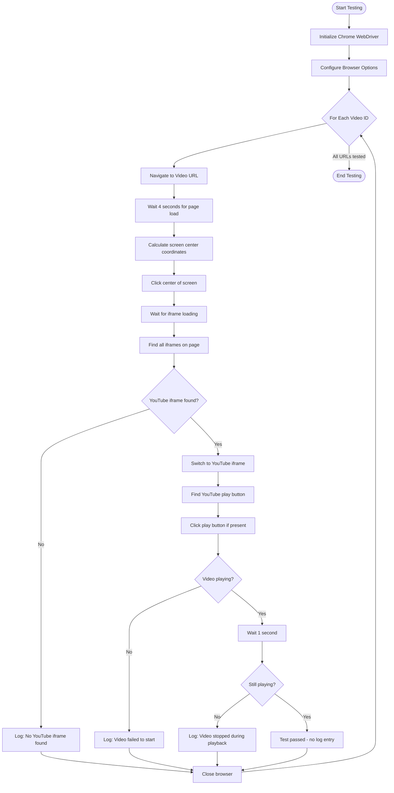
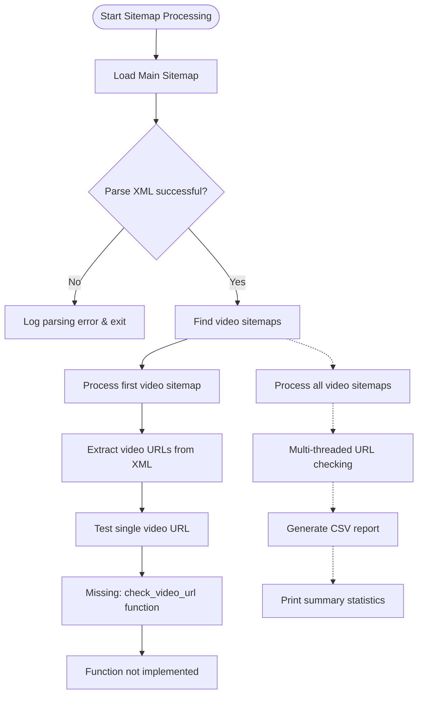
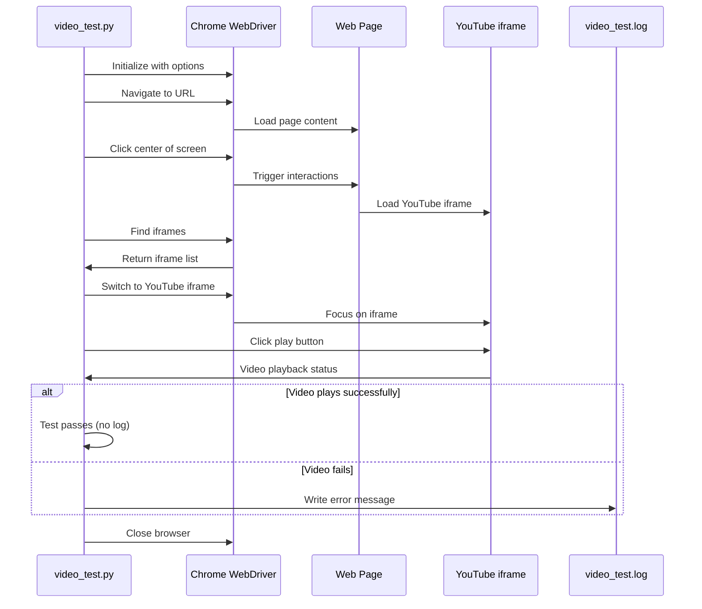

# Video-Playback-Testing-Tool

A Selenium-based automation tool that systematically tests video playback functionality across a range of URLs. The script navigates to video pages, detects YouTube iframes, initiates playback, and verifies that videos are playing correctly.

## Features

### Automated browser testing with Chrome WebDriver
- YouTube iframe detection and interaction
- Video playback status verification
- Comprehensive error logging
- Batch testing across URL ranges
- Headless browser support with optimized Chrome options

### Sitemap Integration
- XML sitemap parsing for video URL discovery
- Support for video-specific sitemaps
- Parallel processing capabilities
- CSV reporting functionality

## Prerequisites

Before running the Video Playback Testing Tool, ensure you have the following installed:

- **Python 3.7+** - Required for running the scripts
- **Google Chrome Browser** - Latest version recommended
- **ChromeDriver** - Compatible with your Chrome version
- **Required Python packages:**
  ```bash
  pip install selenium requests
  ```

## Installation

1. **Clone the repository:**
   ```bash
   git clone https://github.com/your-username/Video-Playback-Testing-Tool.git
   cd Video-Playback-Testing-Tool
   ```

2. **Install dependencies:**
   ```bash
   pip install -r requirements.txt
   ```
   
   Or install manually:
   ```bash
   pip install selenium requests
   ```

3. **Download ChromeDriver:**
   - Visit [ChromeDriver Downloads](https://chromedriver.chromium.org/)
   - Download the version matching your Chrome browser
   - Add ChromeDriver to your system PATH or place in project directory

4. **Verify installation:**
   ```bash
   python -c "from selenium import webdriver; print('Selenium installed successfully')"
   ```

## Usage Examples

### Basic Video Testing (video_test.py)

**Single URL Test:**
```python
from video_test import test_video_playback

# Test a single video URL
test_video_playback("https://example.com/video/12345")
```

**Batch Testing with Custom Range:**
```python
# Edit video_test.py configuration
base_url = "https://your-domain.com/video/"
start_num = 1000
end_num = 1100
step = 1

# Run the script
python video_test.py
```

**Configuration Options:**
```python
# Customize browser options in video_test.py
options = webdriver.ChromeOptions()
options.add_argument('--headless')          # Run in background
options.add_argument('--disable-gpu')       # Disable GPU acceleration
options.add_argument('--window-size=1920,1080')  # Set window size
```

### Sitemap-Based Testing (video_checker.py)

**Basic Sitemap Processing:**
```python
# Configure sitemap URLs in video_checker.py
sitemap_url = "https://your-domain.com/sitemap.xml"
beta_domain = "https://beta.your-domain.com"

# Run sitemap checker
python video_checker.py
```

**Custom Sitemap Processing:**
```python
from video_checker import load_sitemap, get_video_sitemaps

# Load and process custom sitemap
root = load_sitemap("https://example.com/video-sitemap.xml")
video_sitemaps = get_video_sitemaps(root)
print(f"Found {len(video_sitemaps)} video sitemaps")
```

## Configuration

### Environment Variables
Create a `.env` file for configuration:
```env
BASE_URL=https://your-domain.com/video/
SITEMAP_URL=https://your-domain.com/sitemap.xml
BETA_DOMAIN=https://beta.your-domain.com
START_VIDEO_ID=1000
END_VIDEO_ID=2000
HEADLESS_MODE=true
```

### Command Line Arguments
```bash
# Run with custom parameters
python video_test.py --start 1000 --end 1500 --headless
python video_checker.py --sitemap "https://example.com/sitemap.xml"
```

## Output and Logging

### Log Files
- **`video_test.log`** - Contains error logs and test results
- **`video_check_report_YYYYMMDD_HHMMSS.csv`** - Detailed CSV reports from sitemap checker

### Log Levels
```python
# Configure logging level in scripts
logging.basicConfig(level=logging.INFO)  # INFO, DEBUG, ERROR, WARNING
```

### Sample Output
```
2025-02-27 01:23:28 - ERROR - [test_video_playback] - ✗ No YouTube iframe found - URL: https://example.com/video/12345
2025-02-27 01:36:09 - ERROR - [test_video_playback] - ✗ Video failed to start playing - URL: https://example.com/video/12346
```

## Use Case
Designed for testing video content availability and playback functionality across multiple pages, particularly useful for content management systems or video hosting platforms that need to verify their embedded videos are working correctly.

## Main Testing Workflow (video_test.py)



## Sitemap Processing Flow (video_checker.py)



## Sequence Diagram - Testing Process



## Repository Structure

- **`video_test.py`** - Main Selenium testing script with Chrome WebDriver automation
- **`video_checker.py`** - Sitemap-based video discovery tool (incomplete implementation)
- **`video_test.log`** - Error logs and test results
- **`README.md`** - Project documentation

## Troubleshooting

### Common Issues

**ChromeDriver Issues:**
```bash
# Error: 'chromedriver' executable needs to be in PATH
# Solution: Download ChromeDriver and add to PATH or project directory
```

**Selenium WebDriver Errors:**
```bash
# Error: selenium.common.exceptions.WebDriverException
# Solution: Ensure Chrome browser and ChromeDriver versions are compatible
```

**Video Playback Failures:**
- **No YouTube iframe found**: The page may not contain embedded YouTube videos
- **Video failed to start**: Network issues, video unavailable, or autoplay restrictions
- **Video stopped during playback**: Content protection or loading issues

### Debug Mode
Enable detailed logging for troubleshooting:
```python
# In video_test.py, change logging level
logging.basicConfig(level=logging.DEBUG)
```

### Performance Optimization
```python
# Reduce wait times for faster testing
options.add_argument('--disable-images')
options.add_argument('--disable-javascript')  # Use with caution
```

## Contributing

1. **Fork the repository**
2. **Create a feature branch:**
   ```bash
   git checkout -b feature/your-feature-name
   ```
3. **Make your changes and test thoroughly**
4. **Commit your changes:**
   ```bash
   git commit -m "Add: your feature description"
   ```
5. **Push to your branch:**
   ```bash
   git push origin feature/your-feature-name
   ```
6. **Create a Pull Request**

### Development Setup
```bash
# Install development dependencies
pip install -r requirements-dev.txt

# Run tests
python -m pytest tests/

# Code formatting
black video_test.py video_checker.py
```

## Roadmap

### Planned Improvements
- [ ] Complete `check_video_url()` function implementation
- [ ] Add command-line argument support
- [ ] Implement retry mechanisms for failed tests
- [ ] Add support for other video platforms (Vimeo, etc.)
- [ ] Create web-based dashboard for test results
- [ ] Add parallel testing capabilities
- [ ] Implement configuration file support

### Known Limitations
- Currently optimized for YouTube embedded videos only
- No retry mechanism for failed tests
- Limited error recovery options
- Hardcoded configuration values

## License

This project is licensed under the MIT License - see the [LICENSE](LICENSE) file for details.

## Support

For support and questions:
- Create an [Issue](https://github.com/your-username/Video-Playback-Testing-Tool/issues)
- Check existing [Discussions](https://github.com/your-username/Video-Playback-Testing-Tool/discussions)
- Review the [Wiki](https://github.com/your-username/Video-Playback-Testing-Tool/wiki) for detailed documentation

## Current Issues

- High failure rate in video playback tests
- Missing `check_video_url()` function in `video_checker.py`
- Hardcoded configuration values need to be made configurable
